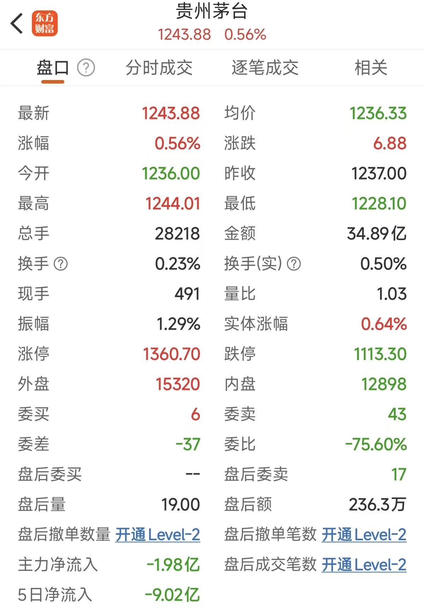
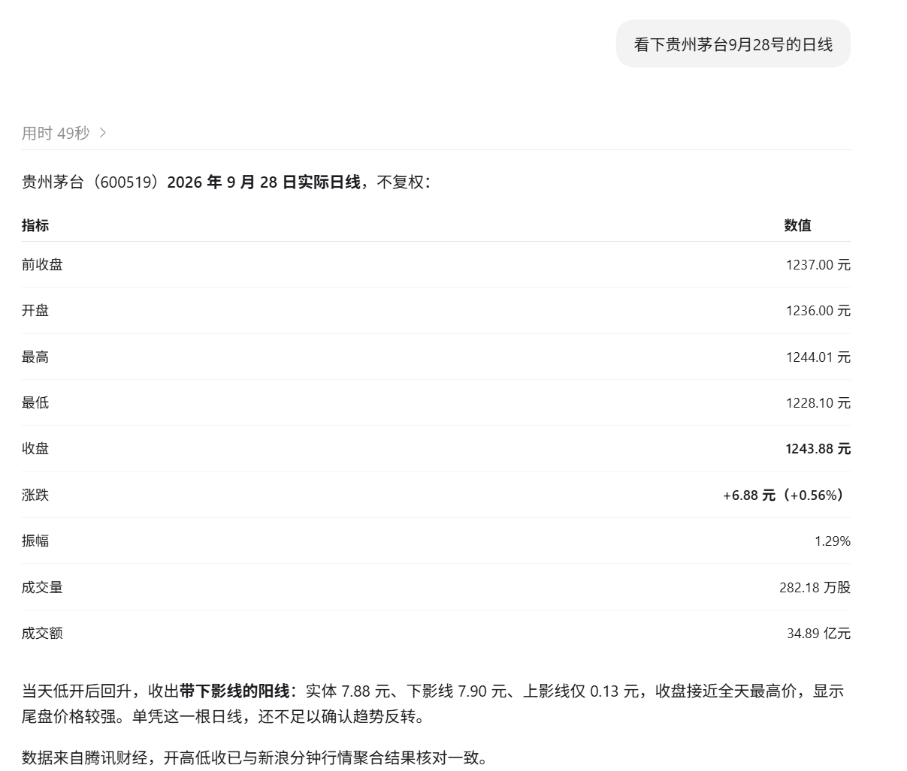

<p align="center"><strong>English</strong> · <a href="./README.zh-CN.md">简体中文</a> · <a href="./README.ja.md">日本語</a></p>

<div align="center">

# Kronos Skills — Financial Candlestick Forecasting Skills

***Five installable AI Agent Skills for AI-assisted quantitative analysis: candlestick forecasting, historical validation, model fine-tuning, visualization, and forecast evidence review through natural-language requests.***

[](https://github.com/shiyu-coder/Kronos)
[](#skills)
[](#setup)
[](https://pytorch.org/)
[](#workflow)
[](./LICENSE)

Kronos Skills provides reusable **financial candlestick forecasting research capabilities** for AI tools that support Skills, including Claude Code, Codex, Cursor, and WorkBuddy. This project is **a toolkit for AI-assisted quantitative analysis based on Kronos**, containing **five Skills that work independently or together**. They cover **stock candlestick forecasting, historical backtesting, model fine-tuning, visualization, and forecast evidence review**. Forecasting supports **Shanghai and Shenzhen A-shares, Beijing Stock Exchange stocks, US stocks, and Hong Kong stocks**, with **daily and 1-, 5-, 15-, 30-, 60-, and 120-minute interfaces**.

**For people interested in quantitative trading and AI-assisted investing!**

**For students and researchers in finance, computer science, and related fields working on financial time-series forecasting, model fine-tuning, quantitative strategy backtesting, and teaching experiments.**

**For people who want AI-assisted quantitative analysis to inform their everyday investing and personal finance decisions.**

**For you if candlestick charts leave you confused, investing makes you anxious, or you want to develop your own judgment instead of always following someone else's trades.**

**It does not promise overnight riches, but it will help you become more confident in your trading and investment strategies.**

**If it improves your chances of selecting stocks correctly, it has served its purpose.**

If you think these Skills still need improvement, that is all right. We are still learning, and we are working to make even a small, useful contribution.

</div>

---

<a id="overview"></a>

## 📈 Introduction

Kronos Skills is **a toolkit for AI-assisted quantitative analysis built around the financial candlestick model developed by a team at Tsinghua University**.

**Kronos-small produces the candlestick forecasts. The Skills organize and execute the workflow. The AI interprets your request, follows the Skills to operate tools, handles errors, and presents and explains the results.**

**Describe what you need in natural language, and the AI follows the relevant workflow to retrieve and verify market data, run forecasts, conduct historical backtests, fine-tune models, visualize results, and review forecast evidence. This turns model capabilities into practical research workflows.**

**[shiyu-coder/Kronos](https://github.com/shiyu-coder/Kronos): the financial candlestick forecasting model developed by the Tsinghua University team.**

| Pretrained model | Parameters | Context length |
| :--- | ---: | ---: |
| Kronos-mini | 4.1M | 2,048 |
| **Kronos-small** | **24.7M** | **512** |
| Kronos-base | 102.3M | 512 |

For the same stock, forecasts can change as the latest market data, input window, and sampling parameters change. The value of these Skills therefore needs to be assessed through ongoing historical validation and real-world tracking. In probabilistic terms, **if they help you analyze financial candlesticks more efficiently and improve stock selection and judgment in validation, they have served their purpose**.

***This package currently bundles only the local pretrained weights for Kronos-small and its matching Tokenizer to reduce hardware requirements and make the tools more accessible.*** Kronos-small has approximately 24.7 million parameters and a context length of 512 candlesticks, balancing model size and computing requirements.

<a id="skills"></a>

## 🧩 Five Skills

Starting with real market data, these five Skills can work independently or together for candlestick forecasting research, historical backtesting, fine-tuning, visualization, and evidence review.

| Skill | Purpose | When to use it |
| :--- | :--- | :--- |
| **`kronos-kline-predict`** | **Forecast future daily or intraday candlesticks from historical data** | **Explore future candlestick trends and price movements** |
| **`kronos-backtest`** | Use upstream entry points to evaluate historical performance and compare strategies with benchmarks | **Evaluate how a model or strategy performed in the past** |
| **`kronos-training`** | Fine-tune the Tokenizer and Predictor on your own market data | **Adapt a model to a particular stock** |
| **`kronos-webui`** | Load data, adjust parameters, and compare forecasts with actual prices in a Chinese or English web interface | **Operate the model visually and inspect forecast differences** |
| **`kronos-buffett-munger-review`** | Assess the support behind forecasts using ideas inspired by Buffett and Munger; this is not forecast accuracy | **Review the evidence supporting an existing forecast** |

### **🎯 Candlestick forecasting: predict future bars from historical data**

**`kronos-kline-predict` supports daily and 1-, 5-, 15-, 30-, 60-, and 120-minute interfaces. During forecasting, the AI actively retrieves and verifies data according to the Skill:**

| **Market** | **Access method** | **Data sources** | **Checks** |
| :--- | :--- | :--- | :--- |
| **Shanghai and Shenzhen A-shares** | **AKShare** | **Sina Finance, Eastmoney, and others** | **Required interval, historical coverage, and completeness** |
| **Beijing Stock Exchange** | **BSE market adapter** | **Official BSE securities directory, Eastmoney, and others** | **Security codes and source coverage for each stock** |
| **US stocks** | **yfinance** | **Yahoo Finance, Eastmoney, and others** | **Exchange timezone, regular sessions, and historical coverage** |
| **Hong Kong stocks** | **yfinance** | **Yahoo Finance, Eastmoney, and others** | **Security codes, lunch breaks, and half-day sessions** |

<h2>📷 Screenshot comparison</h2>
<p>The Eastmoney quote screen is on the left; the daily quote query result is on the right. Click either image to view the original.</p>

<table>
  <thead>
    <tr>
      <th width="30%">Eastmoney · Quote screen</th>
      <th width="70%">Daily quote · Query result</th>
    </tr>
  </thead>
  <tbody>
    <tr>
      <td width="30%" valign="top" align="center">
        <a href="./figures/maotai-eastmoney.jpg"></a>
      </td>
      <td width="70%" valign="top" align="center">
        <a href="./figures/maotai-daily-query.png"></a>
      </td>
    </tr>
  </tbody>
</table>

<h3>🔍 Enlarged daily quote result</h3>
<p align="center">
  <a href="./figures/maotai-daily-query.png"></a>
</p>

**Market-data retrieval accuracy reaches 100%, and user-provided CSV files are also supported.**

**Before forecasting, the workflow checks security identity, timestamps, adjustment conventions, price and volume units, trading calendars, missing bars, and OHLC relationships.**

<a id="workflow"></a>

**Workflow**

```text
Stock, market, date, and interval → Retrieve or read data → Verify data and trading times
→ Prepare model inputs → Run Kronos → Check forecast output → Charts, tables, and report
```

### **🕰️ Backtesting and regression testing: evaluate historical performance**

**`kronos-backtest` reuses the upstream Qlib, CSV strategy, and regression-test entry points. Real model backtests, random historical examples, and program-output regression tests are distinct tasks. Random examples do not demonstrate model performance, and passing regression tests does not establish forecasting accuracy.**

**The original CSV strategy has limitations, including substituting forecast prices when actual prices are missing. These must be disclosed when used. For evaluating a real model and portfolio strategy, prefer the Qlib entry point and verify the data, transaction costs, and benchmark settings.**

**Workflow**

```text
Historical data, model, or existing forecasts → Select backtest entry point → Create an independent working copy
→ Check dependencies and configuration → Run the upstream workflow → Verify metrics, benchmarks, and logs
```

### **🧠 Model training: fine-tune on your own data**

**`kronos-training` supports Qlib data preparation, separate Tokenizer/Predictor fine-tuning, sequential CSV training, and the upstream multi-GPU entry points. Preserve the original source snapshot and existing weights, and write training results into a new experiment directory. Follow training with forecasting and historical validation; lower training loss does not necessarily improve trading performance.**

**Workflow**

```text
Training data and pretrained weights → Split training/validation/test sets chronologically
→ Create an experiment copy and check configuration → Fine-tune Tokenizer/Predictor
→ Save checkpoints → Validate forecasts again
```

### **🖥️ Web interface: operate the model and compare results**

**`kronos-webui` provides Chinese and English interfaces for loading local CSV/Feather data and choosing the model, device, and sampling parameters.**

**Choose a language at startup; ordinary forecasts and result charts do not require the web interface.**

**Workflow**

```text
Choose Chinese/English → Create a WebUI working copy → Import local data → Check and start the service
→ Select model and device → Adjust window and parameters → Forecast, inspect charts, and save results
```

### **⚖️ Evidence review: assess the support behind a forecast**

**`kronos-buffett-munger-review` distills ways of thinking inspired by Warren Buffett and Charlie Munger into a callable forecast-review Skill. It assesses evidential support, not forecast accuracy.**

**It applies Buffett-style evidence assessment and Munger-style inversion to data reliability, historical support, structural errors, sampling stability, and overly certain language. Here, “distillation” means organizing a way of thinking into a workflow. It does not mean training a model on either person, nor does it represent their views or those of their organizations.**

**Workflow**

```text
Existing forecast and information available at the time → Check data conventions and information boundaries
→ Buffett-style evidence assessment + Munger-style inversion → Five scores and hard limits → Review in chat
```

| **Dimension** | **Maximum score** |
| :--- | ---: |
| **Data completeness and consistency** | **30** |
| **Historical direction, magnitude, and benchmark comparison** | **20** |
| **OHLC and trading-time structure** | **20** |
| **Stability across multiple samples** | **20** |
| **Calibration of claims** | **10** |

**The total is an evidence-support score out of 100, not forecast accuracy. Use it after a forecast is produced and before the target market period occurs. Unclear data boundaries, invalid OHLC structures, or only one sample trigger score caps. The Skill returns its review in chat, creates no attachments, and does not read subsequent prices from the target period.**

<a id="markets"></a>

## **✨ Core features**

| **Capability** | **Description** |
| :--- | :--- |
| **Use across Agents** | **The same installer supports Claude Code, Cursor, Codex, Gemini CLI, OpenClaw, WorkBuddy, and OpenCode** |
| **Install as needed** | **Install the full collection, a category, or individual Skills** |
| **Project isolation** | **Choose global installation or installation within the current project** |
| **Five cooperating Skills** | **Forecasting, historical backtesting, fine-tuning, visualization, and evidence review** |
| **Model inference** | **Kronos-small and its matching Tokenizer are bundled; weights can reside in any readable directory, with paths verified and configured by the Agent** |
| **Market-data interfaces** | **Retrieve market data directly through interfaces rather than extracting it from web pages, news, or search snippets, improving retrieval accuracy, traceability, and efficiency** |

<a id="setup"></a>

## **🚀 Getting started**

### **📥 Download the package for your operating system**

| **System** | **Standalone archive (extract to any directory)** | **Size** |
| :--- | :--- | ---: |
| **Windows 64-bit** | **[Kronos-Skills-Windows.zip](Kronos-Skills-Windows.zip)** | **About 119 MiB** |
| **macOS Apple Silicon / Intel** | **[Kronos-Skills-macOS.zip](Kronos-Skills-macOS.zip)** | **About 138 MiB** |

**Both contain the five Skills and matching model weights. Extract the entire archive, then place the Skills in the directory used by your Agent:**

#### 🤖 Supported Agents

| Agent | `--tool` value | Global directory | Project directory |
| :--- | :---: | :--- | :--- |
| Claude Code | `claude` | `~/.claude/skills/<skill-name>` | `.claude/skills/<skill-name>` |
| Cursor | `cursor` | `~/.cursor/skills/<skill-name>` | `.cursor/skills/<skill-name>` |
| Codex | `codex` | `~/.codex/skills/<skill-name>` | `.codex/skills/<skill-name>` |
| Gemini CLI | `gemini` | `~/.gemini/skills/<skill-name>` | `.gemini/skills/<skill-name>` |
| OpenClaw | `openclaw` | `~/.openclaw/skills/<skill-name>` | `.openclaw/skills/<skill-name>` |
| OpenCode | `opencode` | `~/.config/opencode/skills/<skill-name>` | `.opencode/skills/<skill-name>` |
| WorkBuddy | `WorkBuddy` | `~/.workbuddy/skills/<skill-name>` | `~/.workbuddy/skills/<skill-name>` |
| … | … | … | … |

`<skill-name>` refers to **`kronos-kline-predict`**, **`kronos-backtest`**, **`kronos-training`**, **`kronos-webui`**, or **`kronos-buffett-munger-review`**.

### ▶️ Usage

#### **1. Ask the AI to install environment dependencies in your chosen directory**

**Enter:**

```text
Use kronos-kline-predict to forecast the 5-minute price movement of Walmart (WMT) for the next trading day.
Use the US-market extension, label times in US Eastern time, and provide a chart, a table of every bar, and a Chinese report.

I have extracted the package to D:\Kronos-Skills-Windows. (Replace this with your actual directory.)

Use this folder as the workspace and prepare the environment according to the bundled instructions.
Keep the project's Python runtime, virtual environment, model weights, and download caches inside this folder.
Save forecast results in its outputs folder.

Check existing environments, dependencies, and models first. Reuse compatible installations and install only what is missing.
After preparation, run the bundled checks to confirm that the model and device work, then run the Walmart forecast above.

Tell me where the environment, forecast chart, complete bar-by-bar table, and Chinese report are saved.
```

Send this request to the Agent. It prepares the environment before inference and installs missing dependencies from the bundled lists, including PyTorch, NumPy, pandas, einops, huggingface_hub, safetensors, Matplotlib, and tqdm.

#### **2. Install from the command line**

See [Windows command-line installation steps (Chinese)](./Windows命令行安装步骤.md).

<a id="examples"></a>

## **💬 Example requests**

| **Goal** | **Example request** |
| :--- | :--- |
| **Shanghai/Shenzhen forecast** | **“Use Kronos to forecast Kweichow Moutai's daily bars for the next five trading days. Verify the latest data first.”** |
| **BSE forecast** | **“Use Kronos to forecast this BSE stock's 5-minute bars for the next trading day. Verify its current code and source coverage first.”** |
| **US forecast** | **“Use the US-market extension to forecast WMT's 5-minute bars for the next trading day, labeled in US Eastern time.”** |
| **Hong Kong forecast** | **“Use the Hong Kong extension to forecast Tencent 0700.HK's 5-minute bars for the next full trading day. Separate the lunch break.”** |
| **Historical validation** | **“Use the real Qlib entry point in kronos-backtest to examine strategy performance and the index benchmark over this period. Explain the cost assumptions.”** |
| **Model fine-tuning** | **“Use kronos-training to check this CSV's training requirements. Fine-tune in a new experiment directory and preserve the original weights.”** |
| **Open the WebUI** | **“Use kronos-webui to open the Chinese interface and load this existing market-data file.”** |
| **Review a forecast** | **“Use kronos-buffett-munger-review to assess this forecast's evidential support without reading prices that occurred later in the target period.”** |

## **🙏 Sources and acknowledgments**

**This project is based on Kronos: A Foundation Model for the Language of Financial Markets.**

| **Resource** | **Link** |
| :--- | :--- |
| **Upstream model and code** | **[shiyu-coder/Kronos](https://github.com/shiyu-coder/Kronos)** |
| **Paper** | **[arXiv:2508.02739](https://arxiv.org/abs/2508.02739)** |
| **Model weights** | **[Hugging Face · NeoQuasar](https://huggingface.co/NeoQuasar)** |
| **Upstream demo** | **[Kronos Demo](https://shiyu-coder.github.io/Kronos-demo/)** |

**Kronos converts continuous financial candlestick data into discrete tokens, then generates future sequences with an autoregressive Transformer.**

**These Skills reuse the matching Tokenizer and forecasting model. Model sizes are listed in the [introduction](#overview); exact weight versions follow download records and run parameters. A larger model does not guarantee better accuracy for every market or interval.**

**Thanks to the upstream Kronos authors and the open-source projects PyTorch, Qlib, AKShare, yfinance, exchange_calendars, Matplotlib, and Plotly.**

## **📄 License**

This project is licensed under the [MIT License](./LICENSE).
